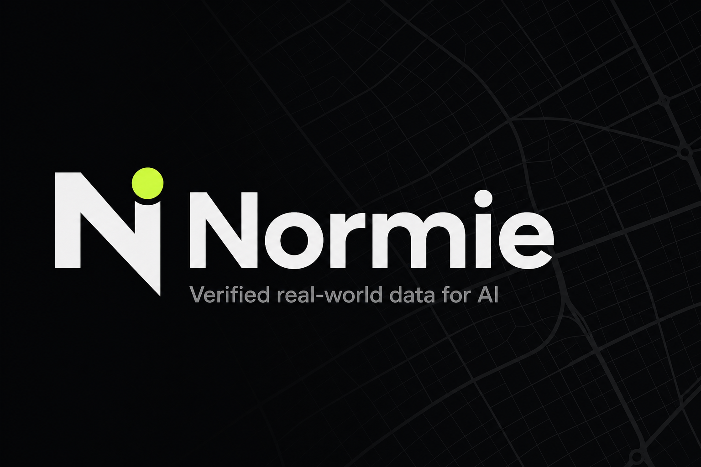
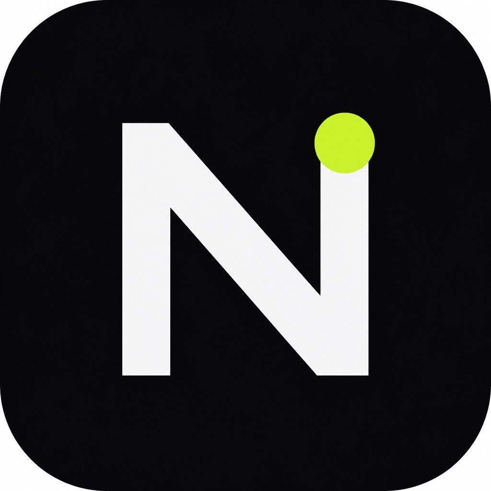

<p align="center">
  
</p>

<p align="center">
  
</p>

<h1 align="center">Normie</h1>

<p align="center">
  <strong>Wallet-owned data network for verified real-world AI datasets.</strong><br />
  Contributors upload. Normie verifies. Qualified media enters public datasets. Claims settle as ETH.
</p>

<p align="center">
  <a href="https://x.com/normiedata">X / Twitter</a> ·
  <a href="https://github.com/NORMIEDATA/Normie">GitHub</a> ·
  Trial under evaluation with foundation labs, autonomy, robotics &amp; manufacturing teams
</p>

---

## What Normie is

Normie is the **supplier layer** for licensable, real-world training data.

At launch we focus on **Normie Streets** — verified road scenes for autonomy and mapping:

- roads & intersections  
- signs & signals  
- potholes & construction  
- parking & traffic conditions  

Contributors connect a wallet, upload media, and earn participation rewards when uploads pass verification and enter the dataset.

---

## How it works

```text
Capture → Upload → AI agent (strict) → Normie Asset ID → Dataset admission
                                              ↓
                         NormiePayouts.pay() → ETH on Robinhood Chain
```

1. **Upload** — street photos (and later video / structured logs)  
2. **Verify** — strict AI agent checks for authenticity, quality, originality, and street labels  
3. **Admit** — approved assets receive a Normie Asset ID and join Normie Streets  
4. **Pay** — ~$1 of ETH pushed instantly via **NormiePayouts** (max 3 / wallet / day)  
5. **Prove** — content fingerprints roll into Merkle batches for public audit  

Unverified or synthetic uploads do **not** enter the payout rail.

---

## Smart contracts

Live payout contract on Robinhood Chain — see **[contracts/](./contracts/)**.

| Contract | Address |
|----------|---------|
| **NormiePayouts** | [`0xc5fc6241f3680f37e718c6fed99fa5352d872558`](https://robinhoodchain.blockscout.com/address/0xc5fc6241f3680f37e718c6fed99fa5352d872558) |

---

## Payouts

| Rule | Detail |
|------|--------|
| Chain | Robinhood Chain |
| Chain ID | `4663` |
| Asset | **ETH only** |
| Amount (trial) | ~**$1** ETH per verified photo |
| Cap | **3** paid photos / wallet / UTC day |
| Source | [`NormiePayouts`](./contracts/) contract balance |
| Destination | Contributor claim wallet |
| Eligibility | Strict AI-agent verified street photos only |

No bank rails. No alternate L2s for settlement in v1.

---

## Public network surface

Without exposing private application code, the live product exposes:

| Area | Purpose |
|------|---------|
| Contributor portfolio | Wallet-scoped assets, scores, rewards |
| Datasets | Live Normie Streets coverage vs targets |
| Network analytics | Verified assets, contributors, label coverage |
| Audit ledger | VERIFIED / REJECTED / DUPLICATE / REWARD / BATCH events |
| Merkle anchor | Batch roots for verified fingerprints |

> **App source, API implementation, model prompts, and infrastructure credentials stay private during trial.**

---

## Architecture (high level)

See [ARCHITECTURE.md](./ARCHITECTURE.md).

```text
┌─────────────┐     ┌──────────────┐     ┌────────────────┐
│  Contributor │────▶│  Normie API  │────▶│  Verify (vision)│
│  + wallet    │     │  + storage   │     └────────┬───────┘
└─────────────┘     └──────┬───────┘              │
                           │                      ▼
                           │              admit / reject
                           ▼                      │
                    ┌──────────────┐              │
                    │  Data store  │◀─────────────┘
                    │  + ledger    │
                    └──────┬───────┘
                           │
              ┌────────────┼────────────┐
              ▼            ▼            ▼
         Datasets     Audit/Merkle   Claim (ETH)
```

---

## Normie Streets

Launch dataset for real-world road media.

| Metric | Intent |
|--------|--------|
| Target scale | Large coverage corpus (streets-first) |
| Reward multiplier | Elevated vs future datasets |
| Status | Filling — under buyer trial |

Buyers evaluating supply include foundation-model labs, autonomy stacks, robotics, and manufacturing inspection teams.

---

## Brand

| Token | Value |
|-------|--------|
| Name | Normie |
| Mark | Geometric **N** + lime node |
| Accent | `#C8F542` |
| Surface | Near-black `#0B0B0D` |
| Type | Syne (display) · DM Sans (UI) |

Assets in this repo: `normie-logo.png`, `normie-mark.svg`, `favicon.svg`.

---

## Roadmap

See [ROADMAP.md](./ROADMAP.md).

**Now (trial)** — private app · verified Streets supply · wallet attribution · audit ledger · ETH claim framing on Robinhood Chain  

**Next** — production claim window · public Merkle anchors on-chain · expanded datasets  

**Later** — optional claim smart contracts if trustless settlement is required  

---

## Security & privacy posture

- Contributions attributed to **wallets**, not email alone  
- Content fingerprinting before dataset admission  
- Privacy masking path for faces / plates before broader exposure  
- Secrets, RPC keys, and private keys are never published here  

See [SECURITY.md](./SECURITY.md).

---

## Links

- GitHub: [github.com/NORMIEDATA/Normie](https://github.com/NORMIEDATA/Normie)  
- X: [x.com/normiedata](https://x.com/normiedata)  
- Contract: [NormiePayouts on Blockscout](https://robinhoodchain.blockscout.com/address/0xc5fc6241f3680f37e718c6fed99fa5352d872558)  
- Explorer: [robinhoodchain.blockscout.com](https://robinhoodchain.blockscout.com)  

---

## License / notice

Documentation and brand assets in this repository are published for transparency during trial.

**Product source code is not included.**

© 2026 Normie
